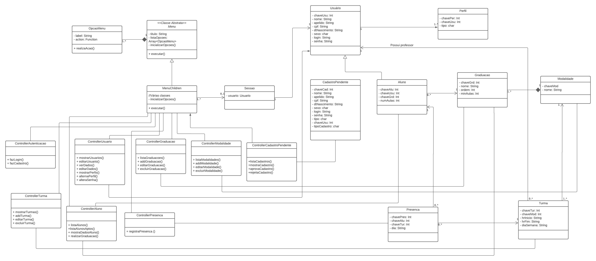

# 20232-team-5
Esse projeto é um sistema de gerenciamento para uma academia de Artes Marciais para controlar a frequência dos alunos.

## Diagrama UML


## Instalação e Compilação
- Instalação do CMake
```
sudo apt-get -y install cmake
```
- Entrar na pasta **src**
```
cd src
```
- Criar arquivos de build
```
mkdir build
cd build
cmake ..
```
- Compilar
```
cd ../
cmake --build build --config Debug --target all
```
